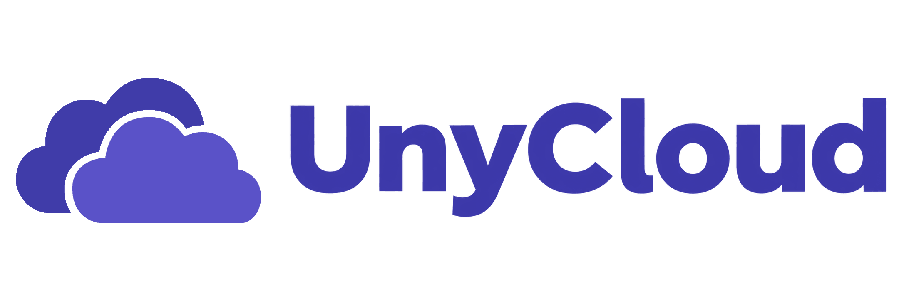

# UnyCloud

<p align="center">
  
</p>

UnyCloud is a maintained fork of File Browser, derived from
[`filebrowser/filebrowser`](https://github.com/filebrowser/filebrowser) under
Apache-2.0.

The goal is deliberately conservative: keep the native File Browser feature set
alive, patch it, harden it, and preserve compatibility for existing users.
UnyCloud is not a rewrite and does not try to become a different cloud product.

## Project Position

File Browser upstream announced the end of active maintenance and repository
archival for 2026-09-01. UnyCloud exists to keep that codebase maintainable for
operators who need the original File Browser behavior to remain stable.

UnyCloud takes over from that point as a maintenance fork focused on:

- security fixes and dependency updates;
- preserving the existing File Browser UX;
- preserving existing database, CLI, flags, config files, and environment
  variables;
- keeping native features available instead of replacing the product model;
- avoiding configuration migrations unless a security fix makes one impossible.

## Compatibility Contract

Compatibility is the main design constraint.

Existing File Browser deployments should keep working with the same operational
model:

- same installed binary path/name for existing services: `filebrowser`;
- same default database format and path behavior;
- same CLI commands and flags;
- same `FB_*` environment variables;
- same JSON/TOML/YAML config behavior;
- same user, share, rule, branding, and settings model;
- same HTTP/API behavior unless a security patch requires a targeted change.

When a breaking change is unavoidable, it must be documented, justified by a
security or correctness requirement, and shipped with the smallest practical
migration path.

## Difference From Quantum

FileBrowser Quantum is a separate fork with a broader product direction.

UnyCloud's direction is different:

- keep the original File Browser architecture familiar;
- keep old deployments and users compatible;
- patch and harden the native feature set;
- avoid forcing a new configuration model;
- prefer maintenance discipline over new platform features.

That makes UnyCloud a conservative continuation path for installations that
need File Browser behavior to remain stable.

## Security

UnyCloud treats exposed file-management software as high-risk software.

Security priorities:

- patch published vulnerabilities where practical;
- keep dependencies current and auditable;
- keep command execution disabled by default;
- harden authentication/session behavior without breaking existing installs;
- preserve safe defaults such as localhost binding and disabled command runner;
- document any risky feature clearly.

Operational recommendations still apply:

- put UnyCloud behind a TLS reverse proxy;
- use external rate limiting and access controls for public exposure;
- run the process as an unprivileged user;
- mount only the directories that must be served;
- do not mount `/`, `/root`, `/etc`, or full host homes unless intentionally
  accepting that risk;
- keep backups of the database, config, and served files.

Known upstream issue classes remain important audit targets:

- command execution, runner, and hooks;
- session and JWT revocation behavior;
- upload and archive handling;
- path traversal and symlink boundaries;
- public sharing permissions.

Published upstream advisories remain relevant background:
https://github.com/filebrowser/filebrowser/security/advisories

## UnyCloud change

The first UnyCloud release establishes the fork and applies the first
maintenance hardening set:

- CSP hardened without inline-script/style escape hatches and without per-build
  CSP hashes;
- runtime bootstrap moved out of inline HTML into static JavaScript;
- loading screen moved out of inline HTML into static CSS;
- Vue legacy bundle generation removed;
- Ace editor runtime removed from the application bundle and replaced with a
  native CSP-safe editor while keeping the stored `aceEditorTheme` field for
  compatibility;
- EPUB embedded reader disabled until it can comply with the strict CSP;
- PDF preview moved from `<object>` to a sandboxed iframe;
- PWA manifest served as same-origin JSON instead of a blob URL;
- login form attributes fixed for browser password managers;
- style-injecting number input dependency replaced by a local component;
- toast notifications replaced by a local CSP-safe host;
- video preview moved to a native CSP-safe player;
- public share and login failure rate limits added using the non-spoofable
  socket peer address;
- security event logs and admin-only `/api/security/*` endpoints added for
  fail2ban/server monitoring integration;
- auth cookies are issued server-side with `HttpOnly`, `SameSite=Strict`, and
  `Secure` on HTTPS;
- unsafe cross-origin write requests are rejected when an `Origin` header is
  present;
- security headers applied globally;
- ReCaptcha CSP sources kept compatible when configured;
- JSON body limits added to admin/share mutation endpoints;
- hook authentication output and runtime are bounded;
- interactive shell execution tightened when shell mode is configured;
- interactive commands bounded by an internal timeout;
- build artifact renamed to `dist/unycloud`.

## UnyCloud v0.17.4

- Updated `README.md`;
- updated `RELEASE_NOTES.md`;
- updated `UNYCLOUD_VERSION`;
- updated `docs/MAINTENANCE.md`;
- updated `docs/installation.md`;
- updated `frontend/package.json`;
- updated `http/http.go`;
- updated `http/static.go`;
- updated favicon assets:
  - `frontend/public/img/icons/favicon.ico`;
  - `frontend/public/img/icons/favicon-16x16.png`;
  - `frontend/public/img/icons/favicon-32x32.png`;
  - `frontend/public/img/icons/apple-touch-icon.png`;
  - `frontend/public/img/icons/android-chrome-192x192.png`;
  - `frontend/public/img/icons/android-chrome-512x512.png`;
  - `frontend/public/img/logo.png`;
  - `frontend/public/img/unycloud/unycloud-logo.png`;
  - `frontend/public/img/unycloud/unycloud-logo-simple.png`;
  - `frontend/public/img/unycloud/unycloud-full-white-logo.png`;
  - `frontend/public/img/unycloud/unycloud-white-logo.png`;
  - `branding/banner.png`.

See [`docs/CSP-AUDIT.md`](docs/CSP-AUDIT.md) for the CSP contract and
[`docs/MAINTENANCE.md`](docs/MAINTENANCE.md) for maintenance/deployment notes.

## Build

Build locally:

```sh
scripts/build.sh
```

Run security checks:

```sh
scripts/security-scan.sh
```

The build artifact is `dist/unycloud`.

Container builds are local in `v0.17.4`:

```sh
scripts/build.sh
docker build -t unycloud:local .
```

Existing deployments can keep their service configured for the legacy
`filebrowser` executable name:

```sh
UNYCLOUD_INSTALL_ROOT=/mnt/server-root scripts/install-legacy-filebrowser.sh
```

This installs `dist/unycloud` to `/usr/local/bin/filebrowser` inside the target
root and keeps a timestamped backup of the previous executable. The script does
not restart services.

## Documentation

Original File Browser documentation remains in [`docs`](docs). It is retained
because compatibility with existing File Browser behavior is part of this fork's
contract.

## License

[Apache License 2.0](LICENSE) © File Browser Contributors and UnyCloud
contributors.
